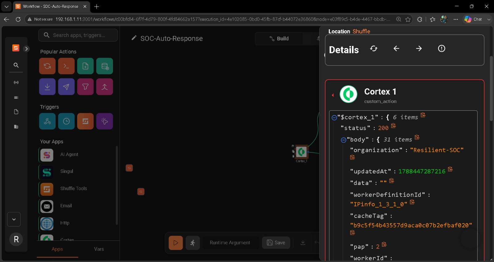
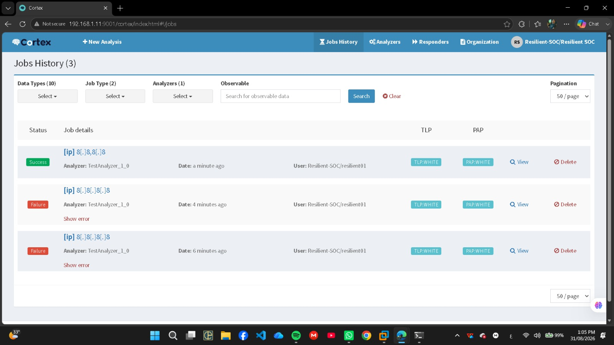
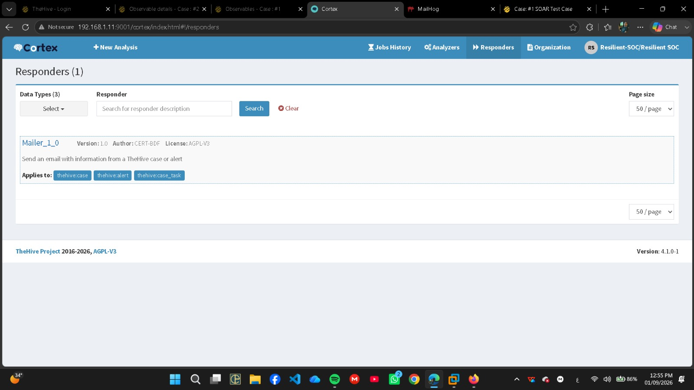
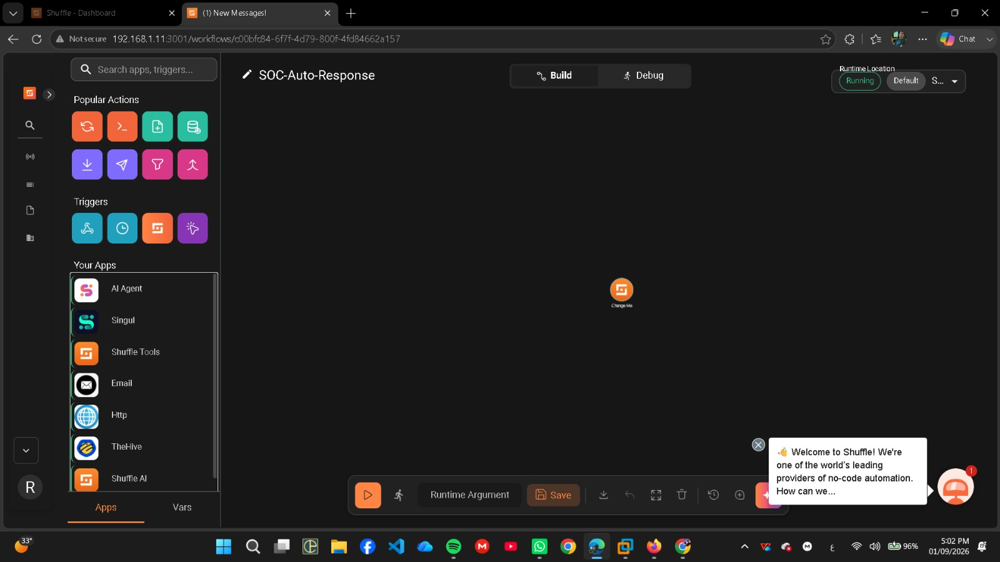
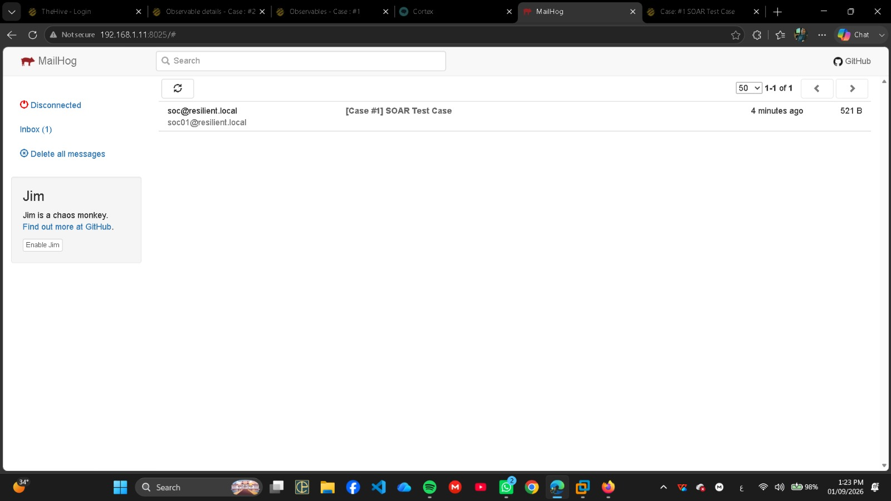
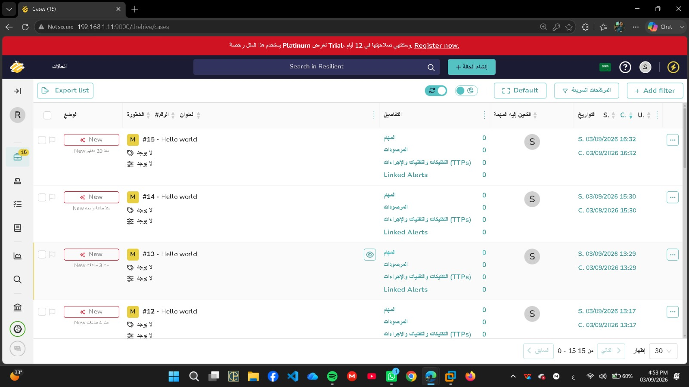

<div align="center">

# 🛡️ Resilient SOC — Case File #003
## Operation Autopilot

**From detection to automated response — a SOAR integration lab built with open-source tools.**




</div>

---

## Overview

Case File #003 scales the manual investigations of Case Files #001 and #002 into a fully orchestrated Incident Response pipeline. A case created in **TheHive** triggers a **Shuffle** workflow that pulls the observable, enriches it with a **Cortex** analyzer, asks a human analyst to **approve or reject**, runs a **simulated** response, then updates the case and sends a notification.

> This is a **training lab**. No production containment is performed — all response actions are simulated.

## 🔄 Workflow

```text
TheHive case
   ↓
Shuffle (SOC-Auto-Response)
   ↓
TheHive observable retrieval  →  $thehive_2.body.0.data
   ↓
Cortex_1 analyzer (IPinfo)  →  HTTP 200
   ↓
Human-in-the-Loop  (Approve / Reject)
   ↓
Simulated containment / escalation
   ↓
TheHive case update
   ↓
Notification (MailHog)
```

Primary test observable: `8.8.8.8`

## Architecture

| Component | Role | Lab URL |
|---|---|---|
| **TheHive** | Case & observable management | `http://<LAB_IP>:9000` |
| **Cortex** | Analyzers / enrichment | `http://<LAB_IP>:9001/cortex` |
| **Shuffle** | Workflow orchestration | `http://<LAB_IP>:3001` |
| Cassandra + Elasticsearch | Storage backends | internal |
| Flask app | Human-in-the-Loop approve / reject receiver | lab-local |
| MailHog | Lab notification sink | lab-local |
| Docker | Isolated infrastructure | — |

**Environment:** Kali Linux (VMware) · Docker · TheHive · Cortex · Shuffle

## What Was Built

See the full checklist in [COMPLETED_TASKS.md](COMPLETED_TASKS.md). Highlights:

- Docker stack: Cassandra, Elasticsearch, TheHive, Cortex, Shuffle
- TheHive ↔ Cortex integration with Bearer API authentication
- Analyzer validation (`TestAnalyzer`, IPinfo) and dynamic observable mapping in Shuffle
- Human-in-the-Loop approve and reject paths through a webhook receiver
- Simulated response, TheHive case update and email notification

##  Selected Evidence

| | |
|---|---|
|  **Cortex jobs history** |  **Cortex responders (Mailer)** |
|  **Shuffle workflow `SOC-Auto-Response`** |  **MailHog notification** |
|  **TheHive cases created by the workflow** |  **Cortex_1 success (IPinfo)** |

Full list: [Evidence/Evidence_Index.md](Evidence/Evidence_Index.md)

## 📁 Repository Layout

```text
.
├── README.md
├── COMPLETED_TASKS.md
├── Documentation/          Full technical write-up
├── Commands/               Commands reference + sanitized terminal history
├── Configuration/          Sanitized configuration notes
├── Evidence/               Evidence index + screenshots
└── Team_Handoff/           Handoff notes
```

## Security Notes

- All credentials, API keys and webhook IDs are replaced by placeholders: `<CORTEX_API_KEY>`, `<THEHIVE_API_KEY>`, `<THEHIVE_PASSWORD>`, `<ELASTIC_PASSWORD>`, `<WEBHOOK_ID>`.
- Lab IPs are written as `<LAB_IP>` (in the screenshots the lab address is still visible).
- Any key that ever appeared in a terminal history or screenshot **must be rotated** (Evidence E-17).
- Do not reuse the lab's default passwords anywhere else.

## Read Next

1. [Documentation/Case_File_003_Operation_Autopilot.md](Documentation/Case_File_003_Operation_Autopilot.md)
2. [Team_Handoff/Team_Handoff.md](Team_Handoff/Team_Handoff.md)
3. [Commands/Commands_Reference.md](Commands/Commands_Reference.md)

---

<div align="center">Resilient SOC Team · Case File #003 · September 2026</div>
